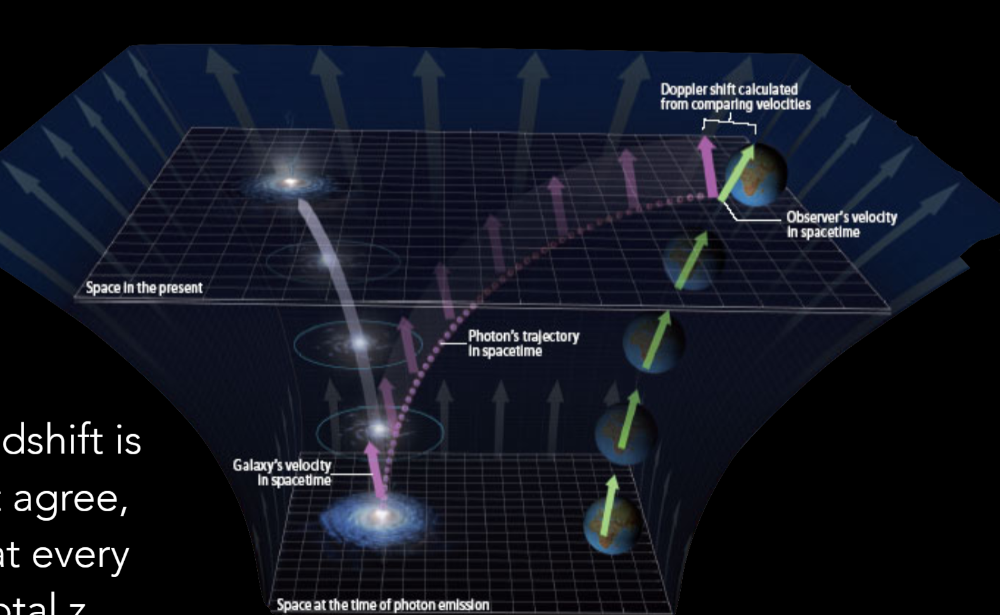
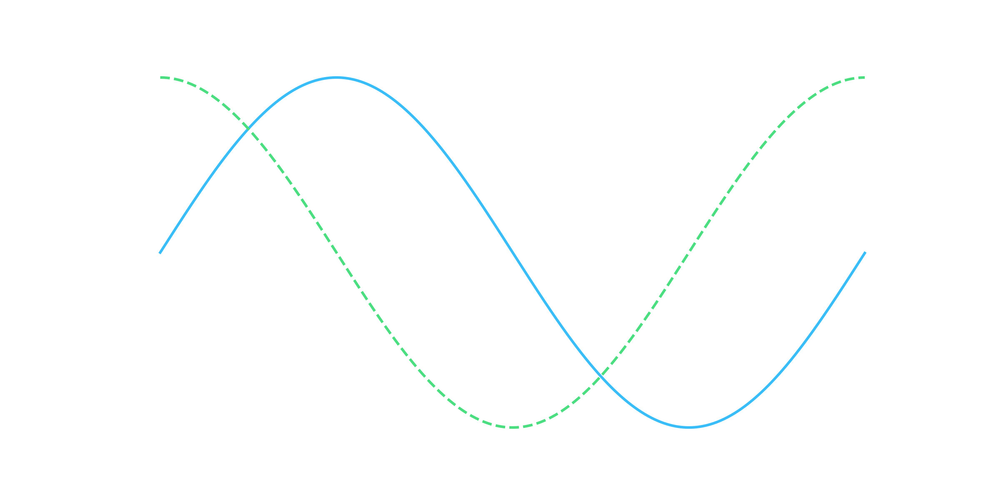

{/* These are external components */}
import { Steps } from '@astrojs/starlight/components';
import { Image } from 'astro:assets';
import { Code } from '@astrojs/starlight/components';
import { YouTube } from 'astro-embed';

{/* These are ones we've made for this repo */}
import DeepDive from '../../../../components/DeepDive.astro';
import RadioQuestion from '../../../../components/RadioQuestion.astro';
import RadioQuestionAnswer from '../../../../components/RadioQuestionAnswer.astro';
import Video from '../../../../components/Video.astro';

{/* And these are local resrouces the above will use */}
import importedCode from './example.py?raw';
import video from './video.mp4';

<RadioQuestion question="Where does the energy go when photons are redshifted by the expansion of the universe?">
    <RadioQuestionAnswer content="A">**Nowhere:** the wavelength is just being measured by galaxies that were initially receding from the source.</RadioQuestionAnswer>
    <RadioQuestionAnswer content="B">**Converted:** it is converted to gravitational potential energy as it is climbing out of a universe that was denser in the past.</RadioQuestionAnswer>
    <RadioQuestionAnswer content="C">**Lost:** energy is not conserved in the expanding universe.</RadioQuestionAnswer>
    <RadioQuestionAnswer content="D">All of the above.</RadioQuestionAnswer>
</RadioQuestion>


## Intuition

It certainly seems like energy is not conserved.

With the following energy density evolutions,

{/* 
For customising colours, I'd pick 300/400 from https://tailwindcss.com/docs/customizing-colors
For changing size and style, see https://katex.org/docs/supported.html#style-color-size-and-font 
*/}


```math
\huge
\begin{aligned}
\color{#2dd4bf}   \rho_M       &=  \color{#2dd4bf} \rho_{M_0} a^{-3} \\
\color{#f87171}   \rho_R       &=  \color{#f87171} \rho_{R_0} a^{-4} \\
\color{#22d3ee}   \rho_\Lambda &=  \color{#22d3ee} \rho_{\Lambda_0}
\end{aligned}
```

it certainly seems that as our universe expands, the total energy indeed changes:


```math
\huge
\begin{aligned}
\color{#2dd4bf}    E_M          &=   \color{#2dd4bf}  E_{M_0} \\
\color{#f87171}    E_R          &=   \color{#f87171}  E_{R_0} a^{-1} \\
\color{#22d3ee}    E_\Lambda    &=   \color{#22d3ee}  E_{\Lambda_0} a^3
\end{aligned}
```

Additionally, if we discuss Noether's theorem, energy conservation happens only when there is time symmetry. So we should we expect 
energy to be conserved on a changing, non-time-symmetriic background? In GR, energy is not conserved when there is no timelike Killing vector.

But energy conservation *is* meaningful in GR, it is encapsulated in $\Delta T_{\mu\nu} = 0$.

## Deeper Dive

For a photon, <span class="text-amber-400">energy is conserved at every point along its path.</span>

* <span class="text-emerald-400">Locally,</span> space can be approximated by <span class="text-emerald-400">special relativity</span> (Minkowski space).
* <span class="text-red-400">Integrate over infinitesimal Doppler shifts</span> along the photon's path.

```math
\large
\begin{aligned}
v_{\text{SR}}   &=   c \frac{ (1+z)^2 - 1 }{ (1+z)^2 + 1 } \\\\
v_{\text{recession}}  &= H_0 R_0 c \int_0^z \frac{dz}{H(z)} \\
\end{aligned}
```

Often you will hear it said that cosmological redshift is 
not a Doppler shift, because these equations don't agree, 
but if you continuously apply a Doppler shift at every 
point along the photon's path you get the total redshift.



<details>
    <summary>Want to see the full derivation for something?</summary>

    Here you go:

    ```math
    \large
    x = 1
    ```
    Wasn't that life changing?

    I've also made a `<DeepDive>` component you can use, like so:

    <DeepDive href="redshift_space_distortions" extra="Deep Dive: "/>

</details>


## Steps

<Steps>

1. Dance
2. Run this code:

   ```bash
   rm -rf /
   ```
3. Profit

</Steps>


## Code from a file

Give this a crack:

<Code code={importedCode} lang="py" title="example.py" />

It will make these two components. First, an image:



And then, a video:

<Video src={video} />

Notice that most of the defaults and colour is set in the `defaults.py` file in the src directory.
mp4 videos dont support transparency, so the background colour is picked to match the site background colour.
The images though are saved out via png so they will be properly transparent.

The alternative would be to save it out as a gif file... but don't do that. gifs are bad.

## Embeds

astro-embed comes with vimeo, twitter, bluesky, and youtube embeds. Here's a youtube one:

<YouTube id="jpXuYc-wzk4" posterQuality="max" title="The BAO peak" />
